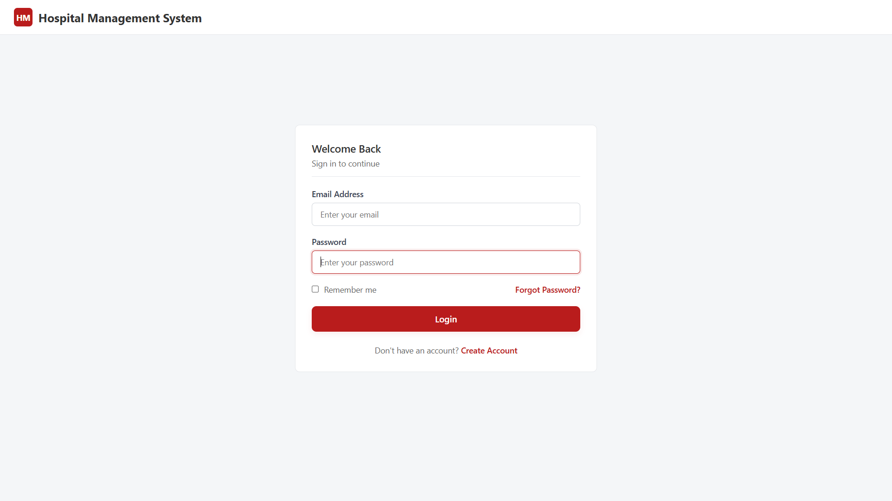
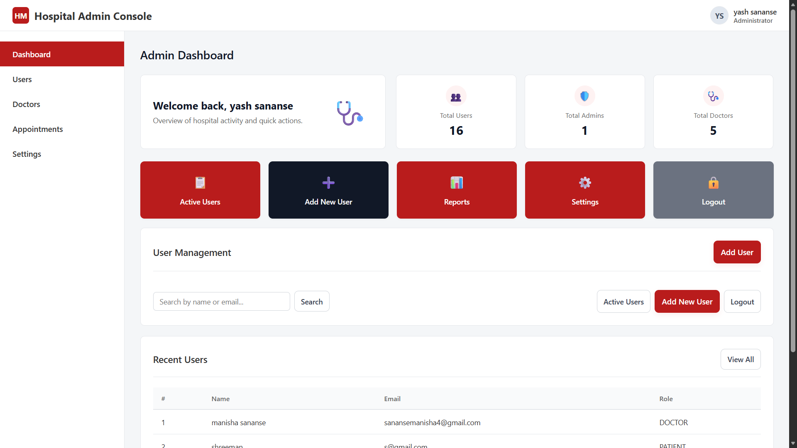
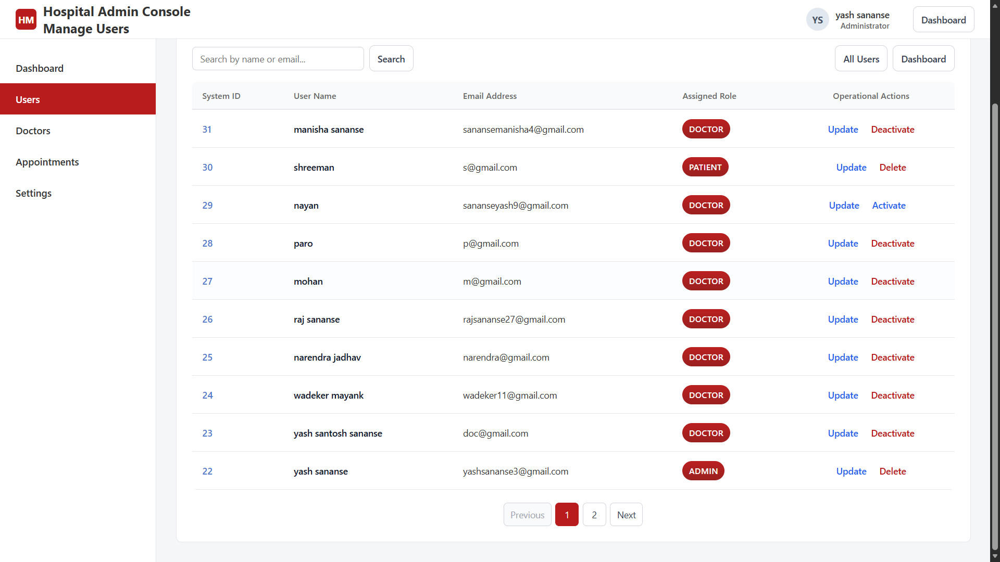
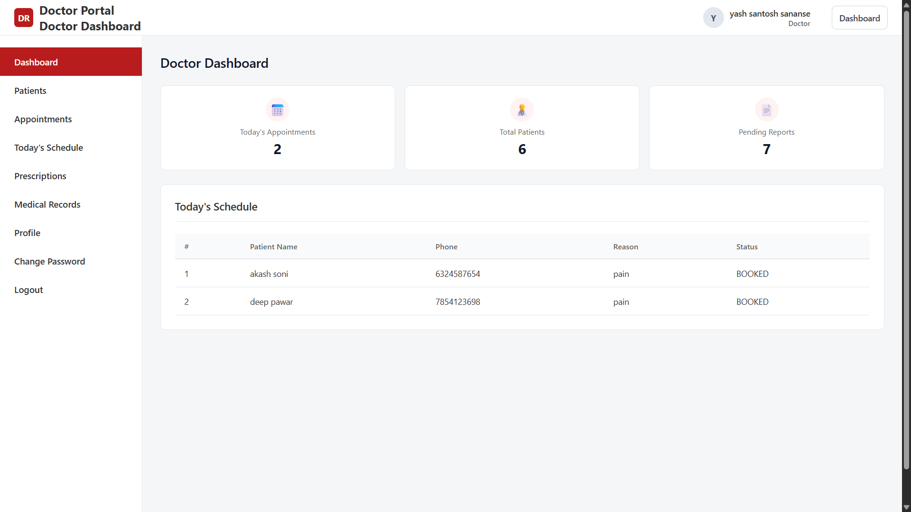
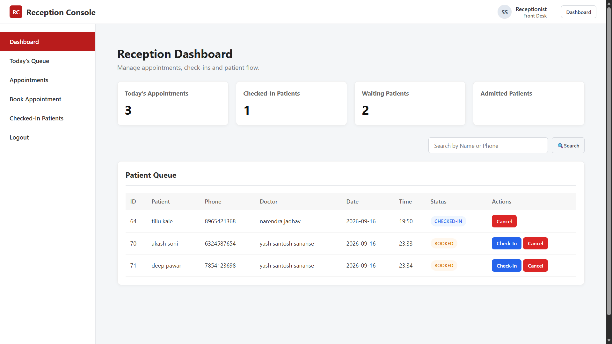
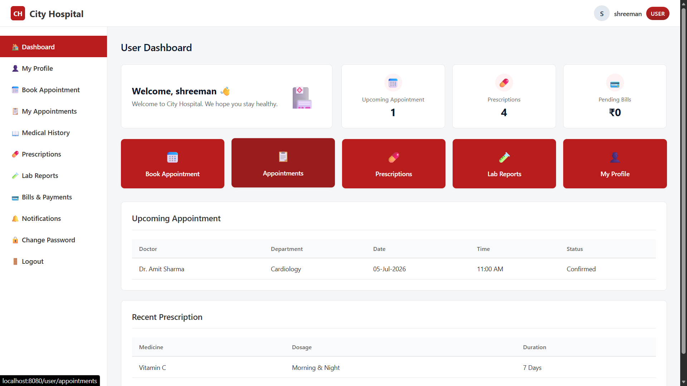
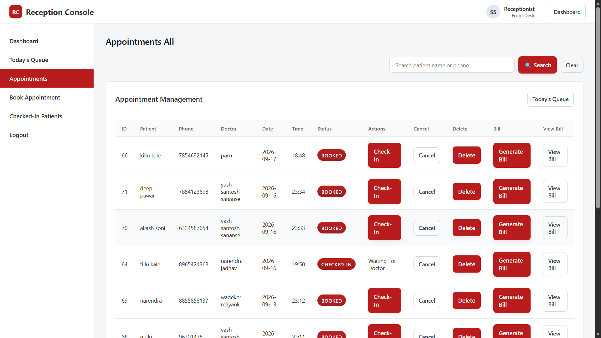
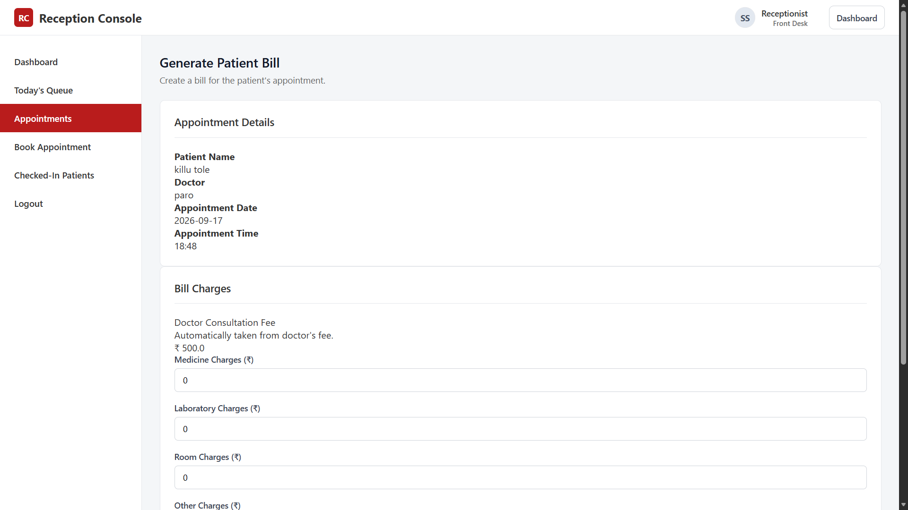

# City Hospital - Hospital Management System

A web-based Hospital Management System developed using Java and Spring Boot to manage hospital operations such as patients, doctors, appointments, prescriptions, billing, and user access.

## Features

- User authentication and role-based access
- Admin management
- Doctor management
- Patient management
- Reception management
- Appointment management
- Check-in and appointment status management
- Prescription management
- Billing management
- Doctor email OTP password reset
- Patient password change with OTP verification
- Search and pagination

## Technologies Used

- Java 21
- Spring Boot
- Spring Security
- Spring Data JPA
- Hibernate
- Thymeleaf
- MySQL
- Maven
- Postman
- Git & GitHub
- HTML
- CSS

## User Roles

The system provides different access levels based on the user's role:

- **Admin** — Manages users, doctors, appointments, and other administrative operations.
- **Receptionist** — Handles patient appointments, check-ins, and billing-related operations.
- **Doctor** — Manages appointments, views patients, and creates prescriptions.
- **Patient** — Books appointments, views appointments, prescriptions, and bills.

## Project Architecture

The application follows a layered architecture:

- **Controller Layer** — Handles HTTP requests and responses.
- **Service Layer** — Contains the application's business logic.
- **Repository Layer** — Handles database operations using Spring Data JPA.
- **Entity Layer** — Represents the database tables and relationships.
- **Security Layer** — Handles authentication, authorization, password encryption, and role-based access.
- **Resources** — Contains Thymeleaf templates, CSS, and application configuration.

## Database

The application uses **MySQL** as the relational database.

The database stores and manages information related to:

- Users and roles
- Doctors
- Patients
- Appointments
- Prescriptions
- Bills
- Doctor OTP verification
- User OTP verification

## Setup and Installation

### Prerequisites

Make sure the following are installed:

- Java 21
- MySQL
- Maven
- Git

### Clone the Repository

```bash
git clone https://github.com/yash-sananse/hospital-management-system.git
cd hospital-management-system
```

### Database Configuration

1. Create a MySQL database.
2. Configure the following environment variables:

DB_USERNAME
DB_PASSWORD
MAIL_USERNAME
MAIL_PASSWORD

These environment variables are used by the application for database and email configuration.

### Run the Application

On Windows:

```bash
mvnw.cmd spring-boot:run
```

On Linux or macOS:

```bash
./mvnw spring-boot:run
```

After starting the application, open the application in a web browser using the configured port.

## Security

The application uses **Spring Security** for authentication and authorization.

Security features include:

- Role-based access control
- Password encryption using BCrypt
- Protected role-specific routes
- OTP-based password verification
- Session-based user authentication

## Project Structure

```text
src/
├── main/
│   ├── java/
│   │   └── com.example.demo/
│   │       ├── controller/
│   │       ├── service/
│   │       ├── repository/
│   │       ├── entite/
│   │       ├── configure/
│   │       └── enums/
│   │
│   └── resources/
│       ├── templates/
│       ├── static/
│       │   └── css/
│       ├── application.properties
│       └── application.properties.example
│
└── test/
```
## API Testing

The application's backend endpoints can be tested using **Postman**.

Postman can be used to send HTTP requests and verify the application's responses.
## Screenshots

### Login


### Admin Dashboard


### Admin User Management


### Doctor Dashboard


### Reception Dashboard


### Patient Dashboard


### Appointment Management


### Billing


## Future Improvements

- Implement a dedicated Nurse module
- Add Lab Reports management
- Expand payment and payment processing functionality
- Add advanced reporting and analytics
- Improve mobile responsiveness
- Add additional automated tests

## Project Status

The core hospital management functionality has been implemented and the application is currently under development.

Additional modules and improvements are planned for future development.
## Author

**Yash Santosh Sananse**

GitHub: [yash-sananse](https://github.com/yash-sananse)